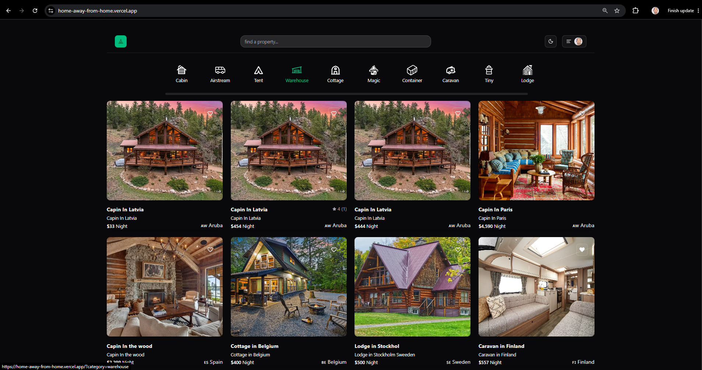
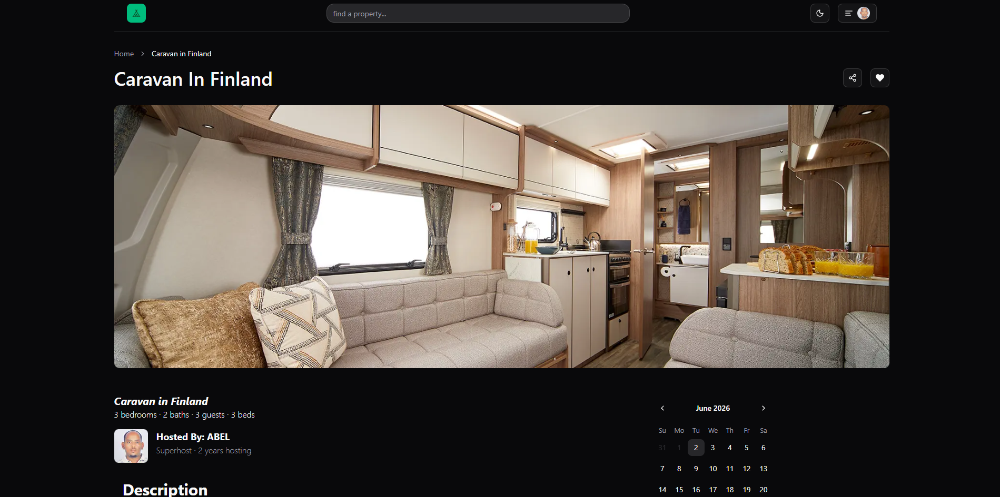

# Home Away - Feel at home, away from home

Home Away is a full-stack, modern vacation rental platform built with Next.js 16. It allows users to browse unique properties, book stays, manage rentals, and leave reviews. The app features a beautiful UI, robust authentication, and secure payment processing.



## 🚀 Features

- **Property Browsing**: Explore properties by categories with advanced search functionality.
- **Booking Management**: Seamlessly book properties using a dynamic calendar and checkout flow.
- **Secure Payments**: Integrated with **Stripe** for safe and reliable transactions.
- **User Profiles**: Personalized user profiles and authentication via **Clerk**.
- **Host Dashboard**: Comprehensive dashboard for hosts to manage their rentals, view stats, and track revenue.
- **Reviews & Ratings**: Share experiences by leaving reviews and ratings for properties.
- **Favorites**: Save and manage a list of your favorite properties.
- **Responsive Design**: Fully optimized for all device sizes using **Tailwind CSS**.

## 🛠️ Tech Stack

- **Framework**: [Next.js 16](https://nextjs.org/) (App Router, Server Components)
- **Authentication**: [Clerk](https://clerk.com/)
- **Database**: [PostgreSQL](https://www.postgresql.org/) (via [Supabase](https://supabase.com/))
- **ORM**: [Prisma 7](https://www.prisma.io/)
- **Payments**: [Stripe](https://stripe.com/)
- **Styling**: [Tailwind CSS](https://tailwindcss.com/) & [Shadcn UI](https://ui.shadcn.com/)
- **Form Handling**: [Zod](https://zod.dev/) & [React Hook Form](https://react-hook-form.com/)
- **State Management**: [Zustand](https://zustand-demo.pmnd.rs/)

## 📸 Screenshots

### Authentication
| Sign In | Sign Up |
| :---: | :---: |
|  |  |

### Property Details
| Detail View | Booking Calendar |
| :---: | :---: |
|  |  |

### Payments
| Stripe Checkout | Payment Success |
| :---: | :---: |
|  |  |

### Host Management
| Dashboard | Create Rental |
| :---: | :---: |
|  |  |

## 🏁 Getting Started

### Prerequisites
- Node.js 18+
- Supabase Account
- Clerk Account
- Stripe Account

### Installation

1. Clone the repository:
   ```bash
   git clone https://github.com/abelMarkos2023/home-away.git
   cd home-away
   ```

2. Install dependencies:
   ```bash
   npm install
   ```

3. Set up environment variables:
   Create a `.env.local` file in the root directory and add your credentials:
   ```env
   # Clerk
   NEXT_PUBLIC_CLERK_PUBLISHABLE_KEY=...
   CLERK_SECRET_KEY=...

   # Database
   DATABASE_URL="..."
   DIRECT_URL="..."

   # Supabase
   SUPABASE_URL="..."
   SUPABASE_KEY="..."

   # Stripe
   NEXT_PUBLIC_STRIPE_PUBLISHABLE_KEY=...
   STRIPE_SECRET_KEY=...
   ```

4. Generate Prisma Client:
   ```bash
   npx prisma generate
   ```

5. Run the development server:
   ```bash
   npm run dev
   ```

Open [http://localhost:3000](http://localhost:3000) with your browser to see the result.

## 📄 License
This project is licensed under the MIT License.
